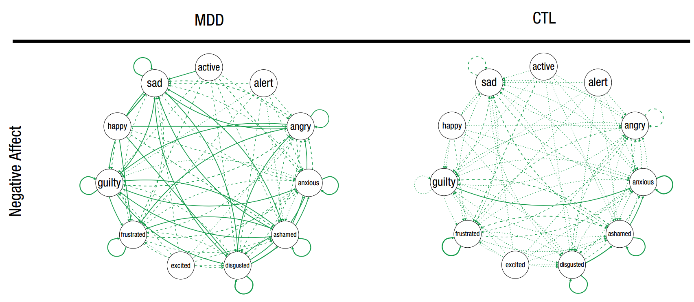

```{r setup, include=FALSE}
knitr::opts_chunk$set(echo = TRUE)
require(networktools)
require(qgraph)
```

## Introduction to network analysis

Perhaps the most familiar type of network is a social network. A social network consists of _people_, and _connections between people_. When we draw a network, we say that the people are _nodes_ and the connections between people are _edges_. Below is a simplistic example of a social network.

```{r social impact 0, echo=FALSE, fig.width = 4, fig.height = 4}
example <- IsingFit::IsingFit(social[,1:5], plot=FALSE, progressbar=FALSE)
par(pin=c(1,1))
plot(example, layout="circle")
```

There are many different types of networks, but each consists of nodes (variables) and edges (connections between those variables). Networks allow us to answer many important questions.

One common question about networks is: "which nodes are important?" This question can be partially answered through measures of _centrality_, which address how well-connected each node is.

_Impact_ is a new statistic for network analysis. Like centrality, it aims to answer the question of "which nodes are important". Impact asks this question in a slightly different way. 

## What is impact?

> __Impact statistics measure the degree to which nodes impact network structure.__

The structures of a networks are meaningful. A well connected network means something different than a sparsely connected network. And even if two networks have the same overall level of connectivity, changes in the structure indicate meaningful differences.

The structures of networks sometimes vary as a function of external variables. For instance, Pe et al. (2015) found that the structure of negative mood networks varied as a function of whether or not individuals had been diagnosed with major depression. You can see this clearly in the figure from the paper presented below: people who have been diagnosed with major depressive disorder have much thicker edges between their negative emotions.



The structures of networks may also vary as a function of _internal_ variables; that is to say, as a function of each _node_. Imagine, for instance, that instead of separating people into networks by "depressed" and "nondepressed", we had separated them by their reported level of sadness in the node "sad". Would structural differences exist between the two networks? This is the question that impact statistics aim to answer!

Let's look at an example in some simulated data to get an idea of what impact can do.

## Impact in a social network

### The _social_ dataset

A group of friends are members of an online social media platform. We have data on 400 social media posts on this platform. For each post, the friends decided either participated in the conversation, or they didn't. They were given a score of 1 if they participated in group conversation regarding the post, and a score of 0 if they did not engage with the post. We can create a social network based on social engagement patterns.

The data is included under the name _social_ in the _networktools_ package. 

Let's plot a network to try and understand how different members of the group are connected in their engagement. 

We'll fit a network using the _IsingFit_ function from the package of the same name. The IsingFit function generates a network where the edges represent partial correlations between nodes. We will first save the results of the IsingFit as an R object named _socialq_, and then we will use the plot function to draw the network. The results can be seen below. Note that in this graph, green edges represent positive partial correlations, and red edges represent negative partial correlations.

```{r initial social}
require(IsingFit)
socialq <- IsingFit(social, plot=FALSE, progressbar=FALSE)
plot(socialq, layout="circle")
```

### What is Kim's impact?

We have an interesting question about our data: Kim seems to be a very polarizing individual, and we want to know how her participation affects the dynamic for rest of the group. Are the connections between friends different depending on whether or not Kim participates?

Let's take a visual look by separating the conversations in which "Kim participated" from the conversations in which "Kim didn't particpate" (we'll go over the code for visualization a bit later). Internally, we are separating all of the conversations into two groups: conversations where Kim participated, and conversations where she didn't. Then, we are computing a network for each group.

```{r social impact 1, echo=FALSE}
impsocial<-impact(social, binary.data=TRUE)
plot(impsocial$Edge, nodes="Kim", title=c("Kim participated", "Kim didn't particpate"))
```

These networks appear to be very different. In particular, it seems that the group is much less connected overall when Kim particpated. But can we quantify this?

One measure of overall connectedness in a network is _global strength_. The _global strength invariance_ between two networks is the global strength of one network minus the global strength of the other. Kim's __global strength impact__ is simply the global strength invariance between the "Kim didn't participate" network and the "Kim participated" network.

We can compute the global strength impact with the _global.impact_ function. 

The _global.impact_ function has several arguments. We enter our data in the _input_ argument. We are interested in Kim, so we'll set the _nodes_ argument to "Kim". Since our data is binary, we need to set the _binary.data_ argument to TRUE.

```{r social impact 2}
kim_global <- global.impact(input=social, nodes="Kim", binary.data=TRUE)
kim_global$impact
```

Kim has a global strength impact of -14.05, meaning that the global strength of the entire network goes down by 14.05 when Kim participates in a conversation.

You might have noticed that the node representing Kim doesn't appear in either of these impact plots. When we split the network according to Kim's data, we are restricting the variance on the node "Kim". This causes all kinds of statistical problems and confounds. To avoid these problems, we temporarily exclude the node of interest when computing impact. 

### What is Rod's impact?

Let's get back to the social dataset. We also have some theories about Rod. Let's take a look:

```{r, echo=FALSE}
plot(impsocial$Edge, nodes="Rod", title=c("Rod absent", "Rod present"))
```

Rod is certainly shaking things up, but in a different way. The overall connectivity between the two networks doesn't seem much different, but the structure seems to change.

We can quantify this with the __network structure impact__. This corresponds to the _network structure invariance_ between the "Rod absent" and "Rod present" networks:

```{r}
rod_structure <- structure.impact(social, nodes="Rod", binary.data=TRUE)
rod_structure$impact
```

You might have noticed that couple of edges in particular are very different depending on Rod. Maybe we are interested in the relationship between Pat and Pam. We can test for this edge explicitly using the __edge impact__ statistic.

The object returned from the _edge impact_ function is a little different, because it returns invariances for every single edge. Instead of returning a single number for each node, _edge.impact_ returns matrices of invariances for each node. Each matrix is organized by node names, so we can look at the edge between Pat and Pam by subsetting the matrix as: _matrix["Pat", "Pam"]_. 

```{r}
rod_edge <- edge.impact(social, nodes="Rod", binary.data=TRUE)
rod_edge$impact$Rod["Pat","Pam"]
```

### Putting it all together with the _impact_ function

So far we've calculated __global strength impact__ (with _global.impact_), __network structure impact__ (with _structure.impact_), and __edge impact__ (with _edge.impact_). For simplicity's sake, and to save on computational burden, we can calculate all three at once using the _impact_ function.

This will return a list of three items:
*an object of class _global.impact_
*an object of class _structure.impact_
*an object of class _edge.impact_

```{r}
social_impact <- impact(social, binary.data=TRUE)
```

So far we've looked at the impacts of specific nodes, based on our hypotheses. But it's also useful to look at the impacts of the nodes in the aggregate. Let's look at a visualization:

```{r}
plot(social_impact)
```

### A note on the _input_ argument

Impact is a property of networks, so when you move to analyzing your own data, you may be tempted to input a network (such as an adjacency matrix, edgelist, _qgraph_, or _igraph_ object) into the impact functions. This will not work! To calculate impact, the algorithm needs the individual observations in your _raw data_. This also means that impact only makes sense for analytically derived networks (networks where the edges represent some type of correlation). The _social_ and _depression_ datasets included in the package are examples of what appropriate data might look like.

So just remember: __input your raw data, not a network object__!

## Impact in the _depression_ dataset

Let's examine impact in a different type of network. Depression can be described as a network of symptoms. I created a simulated dataset containing severity ratings for 9 symptoms of major depressive disorder in 1000 individuals. Symptom ratings are self-reported on a 100 point sliding scale.

Let's plot the overall association network for the symptoms using the _qgraph_ package.

```{r}
require(qgraph)
associationnet <- cor(depression)
qgraph(associationnet)
names(depression)
```

This time around, let's start out by looking at the impact statistics in the aggregate.

```{r}
impact_depression <- impact(depression)
plot(impact_depression)
```

We'll take a closer look at psychomotor retardation and sleep disturbance later on. Before we do, let's discuss how impact in this dataset differs from the first dataset.

### Impact with continuous data

When we had binary data, it was easy to separate the network into "Kim absent" and "Kim present". When our data is continuous, things aren't so simple: we can't just separate the networks easily into "sadness" or "no sadness". 

When data is continuous, the default for computing impact is to use a median split.

But wait a second...didn't I hear somewhere that median splits are evil and should never be used? 

Well, admittedly, median splits are occasionally quite evil. That's because when you perform a median split, you lose variance-- something statisticians strive never to do. Generally, instead of a median split, you can use regression to look at the values from each individual observation without losing variance. Unfortunately, network structure is not a property of an individual observation, it is a property of a sample. That means that we'll have to split our sample up into chunks somehow. I experimented with several methods to keep things in a regression context (random sampling, semi-random sampling, deciles), but found that these methods are highly unreliable unless you have an incredibly large sample. The median split, while slightly less sensitive to subtle changes, is reliable. You can also experiment with different kinds of splits using the _split_ argument.

Let's continue forward and learn a little more about visualization of impact functions.

## Explicitly testing impact statistics with _impact.NCT_

In order to be interpreted in a meaningful way, the significance (or confidence interval) of impact statistics should be explicitly tested.

The _NCT_ function from the _NetworkComparisonTest_ package uses a permutation test to determine the significance of structure invariances between two networks. Because impact statistics are mathematically defined as structural invariance between two networks, _NCT_ is an appropriate method to test the significance of impact statistics. _impact.NCT_ is a nice wrapper function that combines _impact_ with _NCT_ in order to test the significance of impacts.

_impact.NCT_ returns a list with an _NCT_ object for each node tested. Each _NCT_ object includes p-values for invariances (which in this case, are equivalent to impacts).

The _NCT_ method is computationally intensive. For this reason, it is recommended that users test subsets of nodes using the _nodes_ argument, rather than testing all nodes simultaneously. Let's test the global strength and network structure impacts of both psychomotor retardation and sleep disturbance. Let's also test the edge impact of sleep disturbance on the edge between fatigue and worthlessness. Let's use 25 permutations for the sake of speed (in a real analysis, you'd want 1000 permutations or more). Because the permutations have an element of randomness, I'll set a seed.

```{r}
set.seed(1)
NCT_depression <- impact.NCT(depression, it=25, 
                             nodes=c("psychomotor_retardation", "sleep_disturbance"), 
                             progressbar=FALSE, test.edges=TRUE, edges=list(c(5,6)))
```

Now let's pull the relevant p-values out of that object. 

You can check out the documentation for the _NCT_ function from _NetworkComparisonTest_ to learn more about the structure of _NCT_ objects. For our purposes, just remember that global strength impact = glstrinv, network structure impact = nwinv, and edge impact = einv.

```{r}
#Global strength impact of psychomotor retardation
NCT_depression$psychomotor_retardation$glstrinv.pval
#Network structure impact of psychomotor retardation
NCT_depression$psychomotor_retardation$nwinv.pval
#Global strength impact of concentration problems
NCT_depression$sleep_disturbance$glstrinv.pval
#Network structure impact of psychomotor retardation
NCT_depression$sleep_disturbance$nwinv.pval
#Edge impact of concentration problems on fatigue--worthlessness
NCT_depression$sleep_disturbance$einv.pvals
```

## Visualizing impact

The default options for plotting impact functions are pretty useful, and come with some handy arguments. You can explore these further in the documentation files:

```{r eval=FALSE}
?plot.all.impact
?plot.global.impact
?plot.structure.impact
?plot.edge.impact
```

Let's practice visualization with the _depression_ dataset. First, let's visualize impact overall.

We can customize our graph. Let's put the impacts in order from highest to lowest, and let's plot the z-scores of the impact instead of the raw values.

```{r}
plot(impact_depression, order="value", zscores=TRUE)

```

Let's take a closer look at the global strength impact. We can look exclusively at global strength by subsetting the impact object like this: _object$Global.Strength_. This time around, let's look at the absolute values of global strength impact using the _abs_val_ argument.

```{r}
plot(impact_depression$Global.Strength, order="value", abs_val=TRUE)
```

Now let's visualize the impact of sleep disturbance. We can visualize sleep disturbance by looking at two separate networks (the "low" and "high" networks). If you want to plot networks, use the _edge.impact_ object. It contains all of the information about each edge (which we need in order to plot a network!). To plot the "low" vs. "high" networks, specify _type="contrast"_

```{r}
plot(impact_depression$Edge, nodes="sleep_disturbance", type="contrast")
```

We can also visualize each edge impact _as an edge_ in a single network. In this single network, each edge represents the _change_ in edge from low to high. This type of plot is specified with _type="single"_. We can also customize the title.

```{r}

plot(impact_depression$Edge, nodes="sleep_disturbance", type="single", 
     title="Single impact graph: Edge impact visualized as edges")
```

If you want to go further, the key to understanding how to visualize your impact output is realizing that all of the relevant networks are contained in the _edge.impact_ object. The _edge.impact_ object contains the "high" and "low" networks (in adjacency matrix format) for each node under _edge_impact_object\$hi\$nodename_ and _edge_impact_object\$lo\$nodename_. This gives you some more flexibility. Check it out:

```{r}
par(mfrow=c(1,2))
qgraph(impact_depression$Edge$hi$psychomotor_retardation, 
       title="High Psychomotor Retardation", layout="spring", color="lightblue")
qgraph(impact_depression$Edge$lo$psychomotor_retardation, 
       title="Low Psychomotor Retardation", layout="spring", color="lightgreen")
```

## Common problems and fixes

1. Perhaps the most common mistake in using _impact_ is placing a network object in the _input_ argument. Because impact statistics are characteristics of networks, it seems logical that the input would be a network object. Unfortunately, to calculate impact, the algorithm needs the information from each observation in your raw, pre-network data.

 _Do not place an adjacency matrix, edgelist, qgraph, or igraph object in the input argument_. Instead, input your _raw observational data_. You can look at the ?depression or ?social dataset for an example of what that raw data might look like.

2. When calculating impact statistics on your data, you might stumble upon the following warning:

```{r}
#: Sample size difference after split is >10% of total sample
```

 Essentially, this warning indicates that when splitting your data in two, the resulting halves have differing sample sizes. This can occur if your data has limited variance (e.g., lots of observations that fall on the median), your sample size is small overall, or if you have floor/ceiling effects. 

 Why is this a problem? The sparcity of networks computed via graphical LASSO depends on the sample size. Comparing two networks of different sample sizes can result in false positives for impact.

 So what can you do to fix it? One way to fix this problem (if you have continuous data) is to force the sample sizes to be equal. You can do this by setting the _split_ argument to "forceEqual". This will put some observations that fall exactly on the median into the half with a smaller number of observations, such that both halves contain equal sample sizes. This process might weaken your impact value, but doesn't result in overestimation of impact (e.g, may increase Type 2 error, but will not increase Type 1 error).

3. Another problem inherent in network analysis in general is sample size. If you are receiving multiple errors or warnings when you run _impact_, there is a good chance that it is due to a small sample size or insufficient variance in your data. You need a big sample to compute a network! This problem is compounded in impact, where you must temporarily cut your sample in half. There aren't any magic fixes to this problem, so stay on the lookout for this limitation.

## What questions can __impact__ answer? 

In this vignette, we covered the potential uses of impact in social networks and psychopathology networks. Impact applies to other types of networks as well. Here are a few questions that impact might address:

* Which brain areas are responsible for modulating functional connectivity?
* How does the presence of an authority figure impact social relationships in the workplace?
* Does the level of anhedonia in depression affect the overall connectivity between symptoms?
* Are there subtypes of schizophrenia that depend on the level of negative symptoms?
* Does John's presence impact the relationship between Dave and Sue?
* How does one's level of anxiety modulate how their emotions are related to one another?
* Which nodes in an electrical grid modulate the connectivity within the grid?
* Which nodes in my network are important?

Now you have one more tool in your belt for understanding your network data. Happy exploring!

